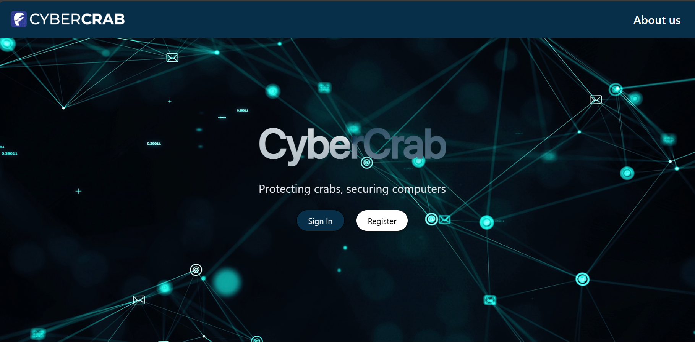
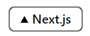

<a href="https://cybercrab.vercel.app/">
  
  <h1 align="center">CyberCrab </h1>
  
</a>

<p align="center">
  Protecting crabs, securing computers
</p>

<p align="center">
  <a href="https://vercel.com/">
    
</a>

  <a href="https://github.com/ReGeLePuMa/CyberCrab">
    
  </a>
</p>


<p align="center">
  <a href="#introduction"><strong>Introduction</strong></a> ·
  <a href="#one-click-deploy"><strong>Installation</strong></a> ·
  <a href="#tech-stack--features"><strong>Tech Stack + Features</strong></a> ·
  <a href="#author"><strong>Authors</strong></a>
</p>
<br/>

## Introduction

CyberCrab is an on-line platform for learning cyber security in a fun and interactive way.

## Installation

Clone the repository:

```bash
git clone https://github.com/ReGeLePuMa/CyberCrab
```

Then, install the dependencies with your package manager of choice:

```bash
cd CyberCrab
npm i
yarn
pnpm i
```

Optionally, you can deploy the app to Vercel with one click:

```bash
npm install -g vercel
vercel
```

## Tech Stack + Features

### Frameworks

- [Next.js](https://nextjs.org/) – React framework for building performant apps with the best developer experience
- [Auth.js](https://authjs.dev/) – Handle user authentication with ease with providers like Google, Twitter, GitHub, etc.
- [Prisma](https://www.prisma.io/) – Typescript-first ORM for Node.js

### Platforms

- [Vercel](https://vercel.com/) – Easily preview & deploy changes with git
- [Vercel Postgres](https://vercel.com/postgres) – Serverless Postgres at the Edge

### UI

- [Tailwind CSS](https://tailwindcss.com/) – Utility-first CSS framework for rapid UI development
- [Radix](https://www.radix-ui.com/) – Primitives like modal, popover, etc. to build a stellar user experience
- [Framer Motion](https://framer.com/motion) – Motion library for React to animate components with ease
- [Lucide](https://lucide.dev/) – Beautifully simple, pixel-perfect icons
- [`next/font`](https://nextjs.org/docs/basic-features/font-optimization) – Optimize custom fonts and remove external network requests for improved performance
- [`ImageResponse`](https://nextjs.org/docs/app/api-reference/functions/image-response) – Generate dynamic Open Graph images at the edge

### Hooks and Utilities

- `useIntersectionObserver` –  React hook to observe when an element enters or leaves the viewport
- `useLocalStorage` – Persist data in the browser's local storage
- `useScroll` – React hook to observe scroll position ([example](https://github.com/steven-tey/precedent/blob/main/components/layout/navbar.tsx#L12))
- `nFormatter` – Format numbers with suffixes like `1.2k` or `1.2M`
- `capitalize` – Capitalize the first letter of a string
- `truncate` – Truncate a string to a specified length
- [`use-debounce`](https://www.npmjs.com/package/use-debounce) – Debounce a function call / state update

### Code Quality

- [TypeScript](https://www.typescriptlang.org/) – Static type checker for end-to-end typesafety
- [Prettier](https://prettier.io/) – Opinionated code formatter for consistent code style
- [ESLint](https://eslint.org/) – Pluggable linter for Next.js and TypeScript

### Miscellaneous

- [Vercel Analytics](https://vercel.com/analytics) – Track unique visitors, pageviews, and more in a privacy-friendly way

## Authors

- Andrei Petrea - Project Manager & Frontend Developer ([@ReGeLePuMa](https://github.com/ReGeLePuMa))
- Radu Manea - System Arhitect & Backend Developer ([@maxwell97](https://github.com/maxwell97))
- Adelin-Costin Popa - DevOps & Presenter ([@AdoX13](https://github.com/AdoX13))
- Claudiu Mogodeanu - Frontend Developer & Challenge Creator ([@claudiu-mogo](https://github.com/claudiu-mogo))
